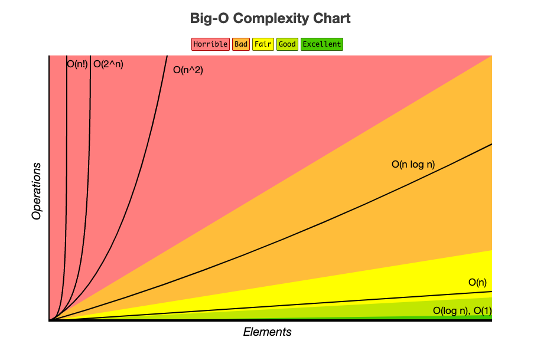

# Data Structures + Algorithms

## Big O

 - **Constants - O(1)**: no loops.
 - **Logarithmic - O(log N)**: usually searching algorithms have log N if they are sorted (Binary Search).
 - **Linear - O(N)**: for loops, while loops through N items.
 - **Log Linear - O(N log(N))**: usually sorting operations.
 - **Quadratic - O(N ^ 2)**: every element in a collection needs to be compared to every other element (Two nested loops).
 - **Exponential - O(2 ^ N)**: recursive algorithms that solves a problem of size N.
 - **Factorial - O(N!)**: you are adding a loop for every element.

In progress... 🏗