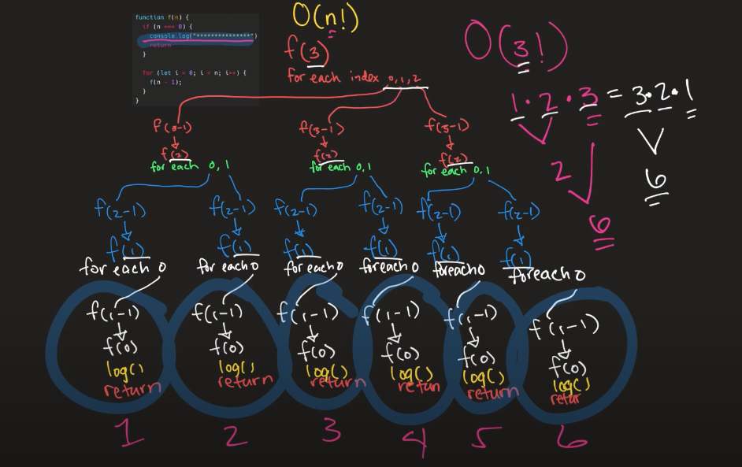

# Data Structures + Algorithms


## What is Big-O Notation?

1. [O(1)](#o1---constant-time)
2. [O(log N)](#olog-n---logarithmic-time)
3. [O(N)](#on---linear-time)
4. [O(n log(N))](#on-logn---log-linear-time)
5. [O(N^2)](#on2---quadratic-time)
6. [O(2^N)](#o2n---exponential-time)
7. [O(N!)](#on---factorial-time)

This notations focuses on finding the best and worst case that our algorithm takes to execute.

> 📝 *We're always looking at the worst case scenario.*

We talk about Big-O when we want to understand:
- how long[^1] an algorithm takes to execute (Time Complexity);
- how much memory is used by an algorithm (Space Complexity);
- says which function, algorithm or code is best;
- describe how efficient we can run our code;

[^1]: The "running time" when using Big-O is not directly linked to the time we know (seconds, milliseconds, microseconds, etc.). Instead we can understand the **time** as the number of operations or steps neeeded to complete a problem of size *n*.

> 📝 *Keep this is mind, Big-O doesn't measure things in seconds. Instead, we're focusing on **how quickly our runtime grows**.*

<br>

### Good to remember 💡

| What can cause time in a function?           | What causes Space complexity? |
| :------------------------------------------- | :---------------------------- |
| operations (+, -, *, /)                      | variables                     |
| comparisons (<, >, ==, !=)                   | data structures               |
| looping (for, while)                         | function call                 |
| outside function call (functionOutOfScope()) | allocations                   |

<br>

### $O(1)$ - Constant time

It takes a constant time to run an algorithm, regardless of the size of the input:

```javascript
function findFirstIndex(n) {
	const firstIndex = n[0];

	return firstIndex;
}
```

In programming, a lot of operations are constant. Here are some examples:

- math operations.
- accessing an array via the index.
- accessing a hash via the key.
- pushing and popping on a stack.
- insertion and removal from a queue.
- returning a value from a function.


<br>

### $O(log N)$ - Logarithmic time

Usually found in tree data structures and in binary search algorithms.
The key point of this notation is: you don't have to go through an entire list to find a certain value, instead, we can split the list in two until we find what we need:

```javascript
// the list is already sorted
function binarySearch(list, value) {
	if (list.length === 1) {
		return list[0] === value;
	}

	if (list.length === 0) {
		return false;
	}

	const mid = Math.floor(list.length / 2);

	if (value < list[mid]) {
		return binarySearch(list.splice(0, mid), value);
	} else {
		return binarySearch(list.splice(mid, list.length), value);
	}
}
```

<br>

### $O(N)$ - Linear time

The run-time increases at the same pace as the input.

In programming, one of the most common linear-time operations is traversing an array:

```javascript
function printAllValues(n) {
	for (let i = 0; i < n.length; i++) {
		console.log(i);
	}
}
```

> *In JavaScript, methods like `forEach`, `map`, and `reduce` run through the entire collection of data, from start to finish.*

<br>

### $O(N * log{N})$ - Log Linear time

The $O(N * log{N})$ complexity happens when we have $log{N}$ interactions, but for every interaction, we traverse the whole list with an additional N complexity:

```javascript
function nLogNFunc(n) {
  for (let i = 1; i < n.length; i *= 2) {
    for (let j = 0; j < n.length; j++) {
      console.log(i)
    }
  }
}

nLogNFunc(Array(4).fill(0)); // O(4 * log4) = O(4 * 2) = O(8)
nLogNFunc(Array(8).fill(0)); // O(8 * log8) = O(8 * 3) = O(24)
```

<br>

### $O(N^2)$ - Quadratic time

An algorithm is "quadratic" when for every item of the input, the whole input is traversed. It happens when we have nested loops:

```javascript
function countOperations(n) {
	let operations = 0;

	for (let i = 0; i < n; i++) {
		for (let j = 0; j < n; j++) {
			operations++;
		}
	}

	return operations;
}
```

In programming, many of the more basic sorting algorithms have a worst-case run time of $O(N^2)$:

- Bubble Sort.
- Insertion Sort.
- Selection Sort.

<br>

### $O(2^N)$ - Exponential time

Means that the calculations performed by an algorithm double every time as the input grows:

```javascript
function powerset(n = '') {
  const array = Array.from(n);
  const base = [''];

  const results = array.reduce((previous, element) => {
    const previousPlusElement = previous.map(el => {
      return `${el}${element}`;
    });
    return previous.concat(previousPlusElement);
  }, base);

  return results;
}

powerset('') // =>  ['']
powerset('a') // => ['', 'a']
powerset('ab') // => ['', 'a', 'b', 'ab']
```

Examples of exponential runtime algorithms:

- Power Set: finding all the subsets on a set.
- Fibonacci.
- Travelling salesman problem using dynamic programming.

> :warning: *You should avoid functions with exponential running times (if possible) since they don’t scale well. The time it takes to process the output doubles with every additional input size.*

<br>

### $O(N!)$ - Factorial time

It means that we're adding a nested loop for every input that we have:

```javascript
function f(n) {
  if (n === 0) {
    return;
  }

  for (let i = 0; i < n; i++) {
    f(n - 1);
  }
}
 
f(3);
```



Examples of $O(N!)$ factorial runtime algorithms:

- Permutations of a string.
- Solving the traveling salesman problem with a brute-force search.

<br>

## Simplifying Big O

### Drop the constants

Since Big-O is concerned with how quickly our runtime grows, the first rule that you want to remember is to **drop any constants** when you analyze an algorithm:

- $O(4 * N) = O(N)$
- $O(512 * N) = O(N)$
- $O(N / 3) = O((1/3) * N): O(N)$
- $O(5 * N * N) = O(N)$

### Different inputs should have different variables

If an algorithm receives different input parameters (e.g., $f(A, B)$), a different calculation is required for each type of situation:

- $O(f(A + B))$: `for` steps in order:
  ```javascript
  for (A) {
	...
  }

  for (B) {
	...
  }
  ```
- $O(f(A * B))$: `for` nested steps:
  ```javascript
  for (A) {
	for (B) {
		...
	}
  }
  ```

### Drop the non-dominant terms

If an algorithm takes $O(f(N) + g(N))$ steps and the function $f(N)$ is bigger than $g(N)$, algorithm’s performance can be simplified to $O(f(N))$:

- $O(N^2 + N) = O(N^2)$
- $O(N + 500 + N^3 + N^2) = O(N^3)$, because $O(N^3)$ it's the worst
- $O(N! + N^{50} + 2^N) = O(N!)$ 

### Big O Examples

```javascript
// What is the Big O of the below function?
// Answer: O(N)

function funChallenge(input) {
  let a = 10; // O(1)
  a = 50 + 3; // O(1)

  for (let i = 0; i < input.length; i++) { // O(N)
    anotherFunction(); // O(N)
    let stranger = true; // O(N)
    a++; // O(N)
  }

  return a; // O(1)
}

// Big O(3 + 4N) => Big O(N)
```

```javascript
// What is the Big O of the below function?
// Answer: O(n)

function anotherFunChallenge(input) {
  let a = 5; // O(1)
  let b = 10; // O(1)
  let c = 50; // O(1)

  for (let i = 0; i < input; i++) { // O(N)
    let x = i + 1; // O(N)
    let y = i + 2; // O(N)
    let z = i + 3; // O(N)
  }

  for (let j = 0; j < input; j++) { // O(N)
    let p = j * 2; // O(N)
    let q = j * 2; // O(N)
  }

  let whoAmI = "I don't know"; // O(1)
}

// Big O(4 + 7N) => Big O(N)
```

In progress... 🏗